---
name: 套打问答
description: 金蝶云星空套打平台问答助手。包含84篇金蝶官方套打技术文章和312张操作截图，覆盖Excel打印、模板设计、分组合并打印、凭证设计、常见故障排查等。当用户询问金蝶套打相关问题时使用此技能。
---

# 套打平台 Q&A 助手

你是金蝶云星空套打平台的资深技术支持专家。你的知识库来源于金蝶官方套打平台知识库（84篇技术文章，含操作截图）。

## Excel打印入门到精通

【Excel模板打印】利用Excel自身强大的函数计算和格式设置功能如：字体样式、单元格格式、页眉页脚、插入LOGO、金额样式等    来完成打印模板的设计，帮助客户快速设计打印模板样式，降低设计难度，从而提高打印模板设计效率。文中 带您从入门到精通 设计Excel打印模板。【emoji】【emoj

## 单据体分组合计打印

应用场景：对采购订单物料代码分组后打印，相同的为一组显示出来模板设置方法：在单据体字段关键字行上一行添加分组标识 ${Group_Begin} 代表分组开始，单据体字段关键字下一行添加 ${Group_End} 代表分组结束。同时，可对多个字段设置分组，在多个字段后加||Group即可。举例：物料代码${Group_B

## 页眉页脚打印

应用场景：设置采购订单打印时，显示当前第几页，共几页模板设置方法：利用Excel自带的页眉页脚功能点菜单-插入-页眉/页脚，分别设置页眉、页脚举例：如上效果图请注意：如果设置的字段关键字对应的是单据体字段，则只会填充第一条分录的数据。

## 分组合并打印

应用场景：将表体物料名称相同值的字段分组合并打印模板设置方法：将需要合并的字段设置分组、合并打印即可举例：将物料名称相同的单元格合并打印 ${Group_Begin} ${FPOORDERENTRY.FMaterialName||Group||merge}${Group_End}设计操作图：效果图

## 父子单据体嵌套打印

应用场景：单据有多个单据体，单据体1的每条明细会有另一个单据体2的多条明细数据，需要将单据体1和单据体2打印在一起显示出来 模板设置方法：将单据体1和单据体2放在一个表单里设计即可，如下图设计操作及效果如下图：

## 日期格式打印

问题描述：套打如何打印出来d/m/yyyy日期格式解决方案：套打单元格属性设置里面格式选择自定义，输入格式化字符串 d\/m\/yyyy

## 凭证模板设计打印

场景1：设计在一张空白的A4纸上打印两页凭证模板；场景2：设计在一张客户购买了凭证模板专业用纸上打印凭证数据。 无论是场景1还是场景2，其中几个设计关键点需注意：页号（第N页/共M页）：取Excel模板第三个页签的常用变量分页之总页数 ${PageCount}---指一张单据总共分M页打印分页之页码 ${Pa

## 分页打印参数

分页打印参数 场景：分页打印：每页打印行数、不足行数以空白行填充、每页间隔大小模板设计说明： 详细参数见下设计分页打印参数： ${Paging||以下参数1||以下参数2||...}1、  单据体每页打印行数：EachPage_行数    不设置此参数则默认5行2、&n

## 分组分页打印

应用场景：对一张单据进行按物料代码进行分组显示、再分页打印模板设置方法：在模板顶、末端加${group_begin}、${group_end},对需要分组的关键字加||group，再设计模板的末端插入分页符即可设计操作及效果如下图：单据按模板打印显示效果：按编码分组、分页打印

## 只取表体第一行

场景：将表体字段放到表头打印，只取表体第一行数据显示打印出来设计：在关键字后增加  ||NotEntry  即可设计操作：打印效果：

## 模板权限控制

知识详情，金蝶云社区,金蝶云,金蝶,财务,金融,会计,企业上云,企业信息化,财务信息化

## 模板隔离显示

用户新增Excel打印模板后，默认所有人可见，无论是否设置以下控制，本人都可见。 如其他用户需设置不可见模板，则增加Excel打印模板列表的查看权限功能控制： 1、	管理员（组）用户在【系统管理】-【系统管理】-【其他】-【打印模板权限控制】对业务对象设置用户、组织、角色、通用的Excel打印模板查看权限，功

## 新增模板选不到

[概述]  1、需确认套打中对应业务对象为[销售退货单];  2、核实登录数据中心为使用的数据中心即可。[操作步骤]  1、使用有权限的用户登录K/3套打设计器,系统视图中依次点击[供应链]→[销售管理]确定进入套打设计器界面;  2、可以点击左上角[新增]或在右侧单击选中对应单据,右击点击复制新增模板;新增空白模板:

## 单元格自适应

问题描述：问题一：EXCEL打印如何设置单元格自适应行高？问题二：设置了自适应换行和自动行高后，单元格仍显示过多的空白或字体显示不全，如何设置正常？问题三：合并单元格不支持自适应显示？解决方案：解决方案见附件

## 标准模板不可见

【问题描述】不想看到预置的套打模板,如何设置【操作步骤】如果不想看到系统预置的套打模板,可以在【套打设置】高级参数中勾选参数“不显示预置套打模板”即可。下图以凭证套打为例:【温馨提示】如果未勾选该参数,但是仍旧看不到模板,大概率是该单据无预置模板,需自行新增:https://vip.kingdee.com/link/s

## 简单数据表格

登录K3Cloud时报错“未能加载文件或程序集Kingdee.BOS.MC.ServiceFacade.ServicesStub”或它的某一个依赖项。系统找不到指定文件。解决方法：请检查Website站点目录中的Common配置文件中的应用服务器所对的管理中心指向配置值是否为空。可能原因：管理中心的配置文件异常导致，m

## 插件重设审批路线数据

应用场景描述：打印凭证带出相应单据的审批流。费用报销单生成的凭证套打时，能获取到费用报销单上的审批信息。引用组件：Kingdee.BOS.dllKingdee.BOS.Core.dllKingdee.BOS.Contracts.dllKingdee.BOS.DataEntity.dllKingdee.BOS.Workf

## 人民币大写忽略角分

背景：客户需要打印价格时，用大写人民币只打印到元，角分不打印出来。如果是小写打印，则可用忽略精度来设置，但是大写的话，目前没有忽略精度。那应该怎么配置呢？下面举个例子：比如我们要打印125.36，用大写人民币打印出来。设置成中文人民币样式，预览效果为：如何去掉角分呢？在选择中文人民币样式之后，点击自定义，请看下面：然后

## 层

有很多客户包括顾问都不知道层，更不知道如何使用层。套打中的层，“不打印”属性是用来隐藏层中所有控件用户自行设置的样式，包括边框字体大小，字体类型等，仅显示默认样式（无边框，字体大小、字体类型等均为默认）和数据。

下面来看看层的使用示例。

1，首先在套打模板页上面拖曳一个层和数据表格，对层属性设置为“不打印”。

2，对数据表格的样式属性“图层”设置为第一步的拖曳的层。

3，对数据表格设置边框，字体样式和大小。

4，预览效果。

可见，对数据表格的自行设置的样式均不起作用。

那么，层的应用场景有哪些呢？

应用场景：可对控件批量进行去样式，例如凭证打印，凭证打印纸张上面已经有了确定的表格样式，只需要打印套打模板上面的字段的数据就行，那么可使用层。

**相关截图：**
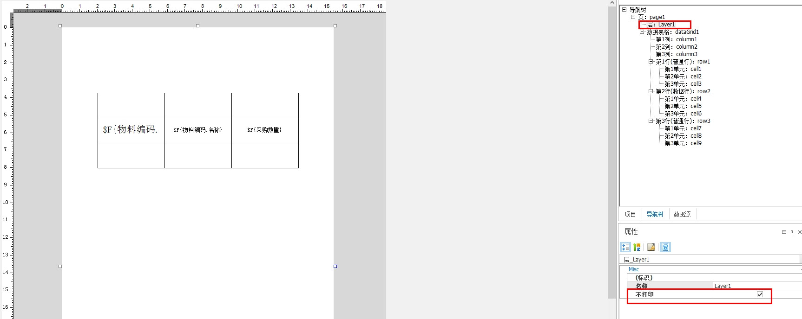
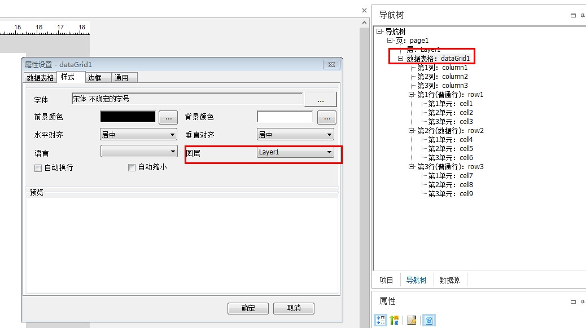
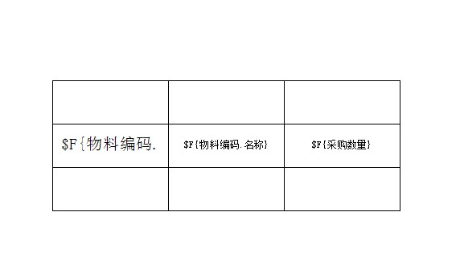
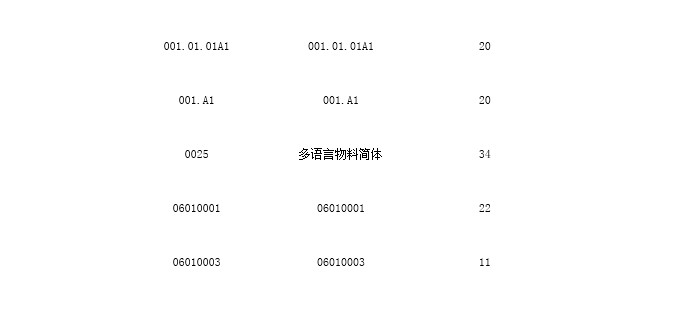

## 连续套打偏移问题

问题描述：连续套打出现偏移如何处理？解决方案：部分打印机和联纸在连续打印多页情况下，存在上下偏移的情况可以尝试作如下处理：1.如果是向下偏移，可以适当缩小模板高度。2.如果是向上偏移，可以适当加大模板高度。通常可以5个单位加减尝试，直到调整到一个合适的加减值。如果按上述设置无效的话，那么需要更换打印机处理了。

## 套打设置应用到指定用户

套打设置可以按用户进行分享。发布版本：7.7.0.202111上线日期：2021-11-05补丁号：PT146894

## 套打脚本配置

套打模板增加"脚本"配置功能，可通过脚本配置实现一些特殊需求，如：套打导出excel时候印章图片不导出，奇数页和偶数页打印预览时候显示不同的颜色。发布版本：V7.7.0.202112上线日期：2021年12月补丁号：PT-146899

## 修改控件内容

【应用场景】套打时，根据格式化后的文本内容进行简单调整，如大写金额微调处理

## 云本地打印说明

------------------------------------------------------------------------------------------------------------------------最新进展：Wnidow平台本地打印服务已经在7.2发布，支持HTML5在Chro

## HTML5本地打印服务

关于为何要本地本地打印服务，如何去掉本地服务的安装提示：1、由于浏览器本身权限很有限，不能直接驱动本地打印机实现纸张，边距，方向，指定打印机等精确打印功能。因此会有Windows平台的本地服务打印。 2、在苹果系统上仅支持直接网页浏览器打印方式，也可以先用PDF导出功能进行导出再打印。苹果系统会直接调用浏览器

## 批量静默打印

使用打印机名选择接口实现批量静默打印【SelectPrinterExt，P...1、选择打印机名称：private selectPrinterNameButtonClick(e){        //参数 0:只返回选中的打印机名称，1：同时返回当前可用打印机列表，100：只返回

## 聚合动态字段

&lt;0&gt;动态字段系列之聚合动态字段功能，Beta发布日期2021/10，正式发布日期2021/11&lt;1&gt;背景：客户在表头显示表体的合计信息，通常比如数量的合计，最大最小的日期等；在历史版本下通过以冗余字段或者打印二开干预，针对这类场景使用不方便；套打聚合动态字段应运而生 &lt;2&gt

## 实体动态字段应用汇总

套打支持单据实体动态字段（基于Python表达式进行配置）套打实体动态字段，常用表达式套打实体动态字段，函数引擎套打核算维度，针对某个维度不打印套打实体动态字段：基础资料字段使用指南套打实体动态字段：结合格式化组合显示套打聚合动态字段按照动态字段分组套打数据表格统计功能支持动态字段套打实体动态字段示例：字符串截取套打实

## 打印闪退问题

【问题描述】使用的奔图7100DN打印，一点打印就闪退，或者在打印的时候，总是出现卡死导致客户端异常关闭的情况，停止工作。【原因分析】业务场景及原因分析：奔图打印机7100DM驱动有闪退缺陷，奔图底层的驱动就是有问题。【解决方案】出现这样的提示是由于奔图打印机7100DM驱动有闪退缺陷问题导致，另外还有错误的打印都要删

## 内容对不齐字段丢失

问题描述：套打模板是正常的，但是在套打模板打印、预览、套打导出时，常常会出现如下的格式问题：模板如图：打印预览如图：问题1：第一行单据编号打印不出来。问题2：第二行付款条件对不齐。问题3：第三行居中，并且行高自适应，但是行很高，没有自适应。套打导出如图：问题4：采购组织已经居中，打印预览也没有问题，但是导出却偏上了。解

## 文本控件

简介
文本控件，可以自定义文本内容，也可以绑定数据源输出单据数据。

数据来源：

单据上的字段：可以从右侧数据源模板中拖到文本控件中；也可以右键→属性、工具条→属性中选择字段。
注意：打印基础资料属性，需先绑定基础资料，在绑定对应字段。

自定义内容：可以双击文本框，手动输入自定义文本值；也可以在属性中设置。
套打自定义文本内容的高阶应用：
①自定义内容可以实现跨实体取多个字段的拼接值，参考：套打文本、条码控件支持跨数据源取单据上面多个字段值进行合并打印

②自定义内容可以实现部分内容取自定义格式，参考：套打GetValue取数函数允许传入格式化字符串

动态字段：支持绑定动态字段，参考：套打实体动态字段应用汇总、二开干预套打取数示例（动态字段使用）

文本控件取数详解：https://vip.kingdee.com/knowledge/687303251607225344

格式：与excel单元格格式类似，支持多种特殊格式，也支持自定义格式，自定义格式使用参考：套打GetValue取数函数允许传入格式化字符串

样式：
a、支持设置字体样式：字体、字形、字号、下划线、删除线、颜色
b、支持设置对齐方式：水平对齐、垂直对齐
c、语言：仅针对多语言文本字段生效，默认取当前环境语言的值，可以指定展示特定语言的值，也可展示全部语言的值。

d、层：参考：关于套打“层”的使用说明
e、自动换行：设置自动换行后，可以选择换行算法
f、自动缩小：设置自动缩小后，可以选择缩小算法
g、两端对齐：当套打导出出现字段换行位置被遮盖的问题时，可尝试勾选此参数。
h、控件下方留白：对于行高自适应的控件，输出高度=文本高度+控件下方留白高度

边框：支持设置边框的颜色、笔型、线宽、显示位置。

通用：
a、支持设置文本控件位置、宽度、高度。
b、不打印：勾选后，可以不打印当前控件
c、锁定：勾选后，不能够通过拖动来移动文本位置、调整控件宽高
d、导出不显示：套打导出不显示
e、充满：文本控件嵌套在表格里的时候，可以设置横向充满、纵向充满
f、前缀、后缀：在文本控件内容的前后加上前缀和后缀

**相关截图：**
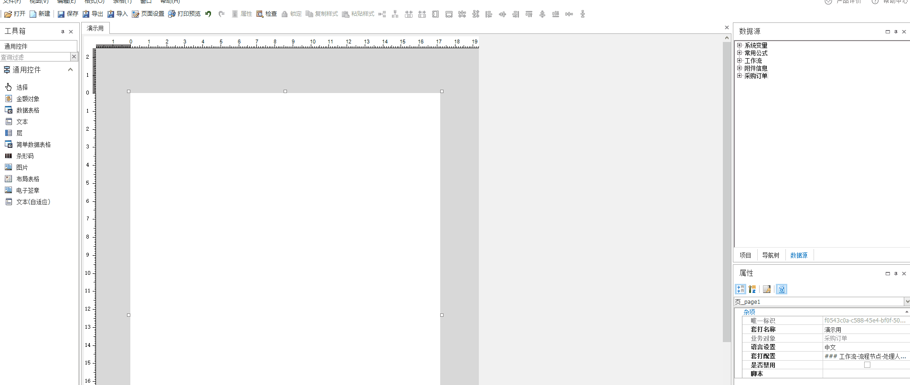
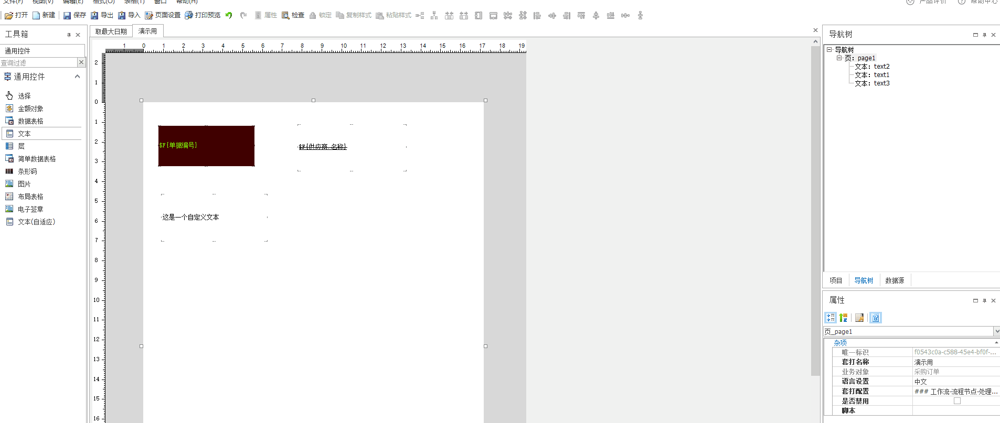

## 布局表格

简介

套打布局表格主要应用于在套打模板中进行排版布局

功能介绍

a、支持设置行数、列数、插入行、插入列

b、支持调整列宽、行高

c、布局表格绑定数据源需要嵌套文本控件

d、支持设置行高自适应、嵌套文本自适应

e、支持设置是否每页出现

使用说明

a、插入行、插入列，可在菜单栏表格→插入行/插入列；删除行、删除列，可在右侧导航树选到对应的行，按住delete删掉即可。

b、可手动拖动列宽行高、也可以通过数值精准配置

c、嵌套文本控件绑定数据源

d、行高自适应：支持行高按照实际内容自适应显示；嵌套文本自适应：支持行内的文本控件行高自适应。

e、每页出现 ：勾选后，每页出现。

**相关截图：**
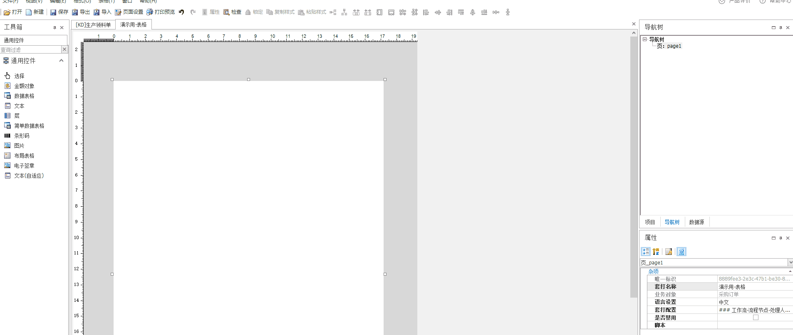
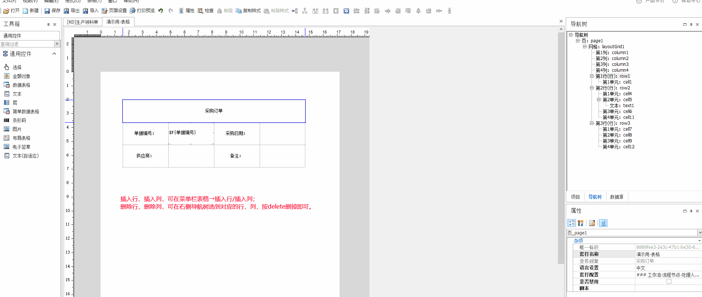
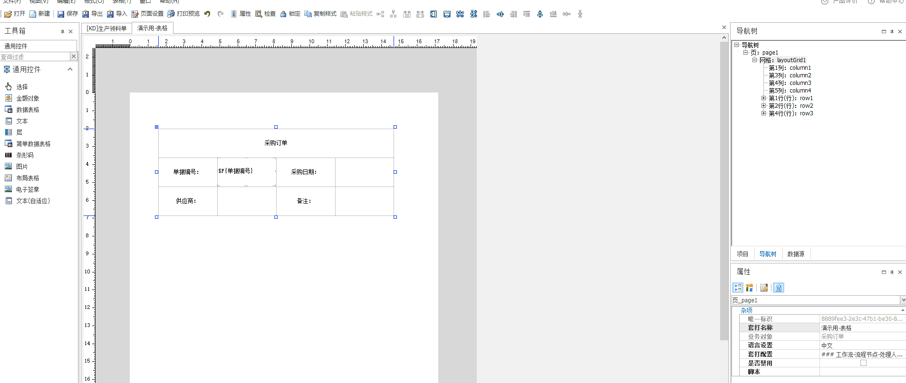
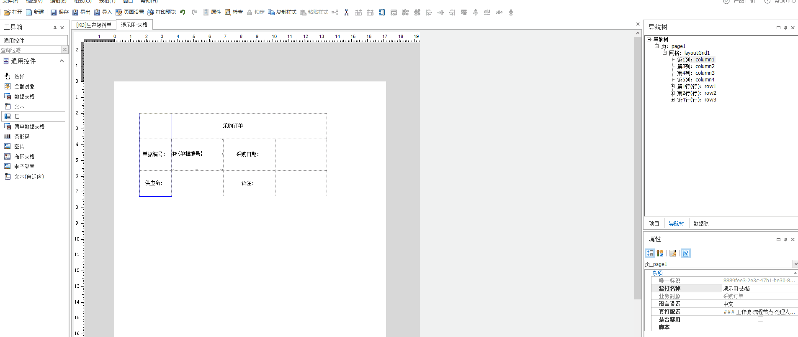

## 条形码

简介

常用于商品标签、资产标签等需要扫码枪识别的条码、二维码的场景。目前套打平台有普通条码和高级条码两种，支持Code128、EAN13、Qrcode等多种常见码。

功能说明

支持绑定可选数据源、自定义文本、动态字段。与文本控件可绑定数据源相同，套打控件——文本控件详解

支持选择编码方式。

注意：如果条码打印不出来，请注意排查所选的条码是否支持编译数据源内容

①条形码不支持中文，打印中文只能使用二维码。

②code128是是根据数据内容自动选择A\B\C字符集，以最短的方式编码图形

   code128-A支持数字、大写字母、控制符、特殊字符

   code128-B支持数字、大写字母、小写字母、特殊字符

   code128-C支持[00]-[99]的数字对集合,共100个

对齐方式：支持设置条码居左、居中、居右。

显示文字：支持显示文字、设置文字位置、字体、字号等。

旋转方式：支持旋转条码。

放大倍数：提高条码识别率。扫码识别慢的时候，可以调大放大倍数提高扫码识别率。

注意：并不是越大越清晰，建议一点点调高，扫码快速准确即可。

格式化：支持EAN13 静区标。

忽略转义符：支持在条码原始字符串里面插入FNC1转义字符，参考套打条码控件功能改进

DPI：DPI越高，清晰度也就也高。DPI受打印机打印精度限制，如果超过打印机精度，设置再高也没有用，反而会影响打印性能。建议非必须，可以不考虑此项。

模宽：窄条的宽度

自定义拉伸系数：在模宽auto的情况下可调整，范围0~50

特殊条码，医疗器械唯一标识GS1条码打印

**相关截图：**
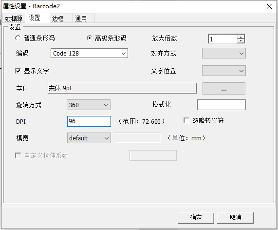

## 导出Excel空列断列

问题描述：在套打导出Excel时，经常会有遇到这样的问题，为什么套打导出的Excel会断开如下图所示：原因说明：套打模板设计如下，针对不同的标题长度，对整行合并然后放入文本控件调整不同的文本控件宽度。从图上可以看到，我们的“名称及规格”列与文本控件存在交叉部分，有可能会导致这种断列情况，试想一下，如果在一个Excel表

## 换行位置问题

【应用场景】套打时，在打印中，出现部分输出内容换行如下图所示

## 行高自适应导致打印500页

本章主要介绍数据表格数据行的行高自适应，有设计的原理以及不同嵌套方式可能存在的问题以及对应解决方案的说明。&lt;0&gt;前置名词定义设计时高度：套打模板上对应控件的固定高度运行时高度/输出高度：套打模板上对应控件的输出高度剩余输出高度：当前控件位置距离可输出页面最下方边界的高度&lt;1&gt;数据表格数据行行高自

## 导出内容乱码

 现象：套打打印预览是正常的，但是套打导出的时候，字体无法解析，部分内容不显示，内容乱码等。原因：套打打印为金蝶自己实现的，针对套打打印我们实现了备选字体列表，也就是如果针对这个字体无法解析我们会进行其他字体的输出；而套打导出是第三方组件实现的，当当前字体无法针对该文本内容进行输出时，就无法输出（情况包括无输

## 列表操作数据丢失

经常有客户反馈列表套打操作数据缺失的逻辑（缺少对应的勾选行数据）如列表套打所选分录缺少所选行，套打所选单据缺少单据等类似问题。如果使用的是客户端套打，情况可能为以下场景：&lt;1&gt;点击列表行进行勾选操作；&lt;2&gt;点击完成后点击菜单的套打相关操作。从客户的角度上两个操作是按序触发的，但是由于服务端处理为

## 单据套打数据与界面不一致

&lt;0&gt;概述经常会有客户反馈针对个别单据出现套打对应的字段丢失问题，但过段时间打印异常问题。而单据类套打是针对单据上的字段是直接从数据库中取对应的数据，仅针对嵌套的基础资料字段才会有缓存。排除掉套打中不支持的字段取值外，所有字段的取值都应该与数据库中的一致，也就是说不会出现上一次打印和这一次打印不一致的问题（

## 创建视图套打导出

&lt;0&gt;场景我们套打导出的时候，不一定都是导出当前单据，会有导出关联单据的需求，比如在处理采购申请单的时候，需要导出申请付款单的文件。&lt;1&gt;分析我们会首先想到通过表单插件进行套打数据包的干预，但是因为是关联的单据，对应干预接口无法被调用（视图的插件非目标单据插件），因此本文提供一个创建目标单视图套

## 每页页脚实现

&lt;0&gt;每页出现常规的每页显示功能就如字面意思：该行在当前数据表格输出的每一页中都会输出当前行，如下图所示：&lt;1&gt;实现页眉页脚正常情况下如果使用了一个数据表格（报表型），那么数据行会一直做尝试输出，所以整个数据表格的输出高度会不断增大，以至于在其下方放置的控件被覆盖。现在有个场景就是这样的一个问题

## 套打干预数据包接口

&lt;0&gt;简介套打干预数据包的接口逻辑是套打二开的常见方法，本文将完整的演示接口逻辑和关键细节。&lt;1&gt;初探套打干预数据包接口通过表单插件或列表插件重写OnPrePareNotePrintData，根据系统提供的参数了解接口：以工序计划为例，单据头、工序序列单据体、工序列表子单据体三级关联数据套打为例

## 数据表格动态列

针对数据表格输出动态内容包括两种情况：&lt;1&gt;数据表格列数是固定的，只是不同场景下对应的取值字段不一样案例：单据上有采购数量A和采购数量B两个字段，用户1仅对采购数量A有权，用户B仅对采购数量B有权，想在一个模板上打印采购数量字段。解决方案：这个时候就可以通过套打干预数据包，绑定一个动态字段，判断当前上下文的

## 报表套打修改标题

方法一：通过表单插件修改套打数据包OnPrepareNotePrintData进行套打数据更正该方案不提供示例，可参考帖子套打通过表单插件OnPrepareNotePrintData修改数据该方案由于为套打数据修正，仅影响套打的数据包，界面数据包不受影响；使用场景，在不调整界面控件内容情况下在套打中输出不一样的报表标题

## 核算维度不打印

【场景】套打核算维度，针对某个维度不打印【效果】过滤掉费用项目维度不进行打印（支持的补丁版本：20210513 PT-146876 [7.6.0.202105]）备注：如果不了解怎么配置核算维度组合值的显示样式，参照 套打实体动态字段，常用表达式，搜索 弹性域字段格式化函数FlexFormat【实现

## 常用表达式

&lt;0&gt;基于动态字段新版套打功能：套打支持单据实体动态字段（基于Python表达式进行配置）&lt;1&gt;日期相关假定日期字段FArrivalDate；年：FArrivalDate.Year月：FArrivalDate.Month日：FArrivalDate.Day增加（减少）X天：FArrivalDat

## 审批路线流程节点二开

&lt;0&gt;简述套打中支持获取对应单据审批路线和流程节点的数据，以下内容描述套打中对应工作流数据的取数逻辑和干预数据包接口的数据结构演示数据如下：&lt;1&gt;套打中工作流的实现第一步，根据业务对象标识和单据内码获取当前运行流程实例Id，根据业务对象标识和单据内码能够获得多个流程实例，需要考虑历史流程终止的处

## 数据表格审批路线数据源过滤

【场景】我们在套打的时候，经常会有这样的需求：“审批路线只需要打印审批同意的”，“树形单据体只打印第一级的”，只打印每一个特定数据等。通常遇到我们这种问题，我们都会联想到数据表格的数据源过滤条件。这里我们说一下审批路线数据源过滤条件的用法，这个问的比较多。（备注：审批路线和单据实体数据可能的表现方式不一，单据实体数据可

## 自实现合并套打全部分录

&lt;0&gt;场景销售出库单打印，其中物料类型很多，不适合针对每一个物料建一个套打模板（在模板上设置过滤），同时数据量较大（列表一样显示不全）；客户想要合并套打所有同一个物料的分录数据。&lt;1&gt;现状套打目前不支持合并套打全部分录操作。&lt;2&gt;方案一：通过报表实现基本很少会有按列表全部数据操作（按

## 自实现合并套打所选子分录

【现状】系统针对子分录只有连续套打所选子分录操作；而合并操作只有合并单据和合并分录操作。【演示数据】以工序计划为例，套打模板如下设置，数据表格绑定工序序列单据体，数据行嵌套文本控件绑定单据头字段，嵌套简单数据表格绑定工序列表子单据体。合并套打所选分录效果如下（会打印所选分录下的所有子分录）：连续套打所选子分录效果如下（

## 跨业务对象套打

上一篇当前业务对象套打的例子【套打】表单插件实现当前业务对象套打上一篇中提到的跨业务对象更新打印次数的问题，最后在检查了下，打印次数更新是以List&lt;PrintJob&gt;中第一个的业务对象标识进行对应业务对象更新，所以应该是支持到的，但是一定要确保整个打印任务中所有内码都为其业务对象标识的内码，否则会更新错误

## 表单插件实现套打

不使用套打操作进行套打（连续套打或者单个打印）：代码上该有的注释都有了，逻辑就是生成打印任务List&lt;PrintJob&gt;，放到当前视图缓存中，然后发送前端指令告诉前端调用套打服务，套打服务根据当前视图缓存的打印任务生成对应的套打布局。套打模板的获取暂时可以根据PrintServiceHelper.GetTe

## 数据表格

【简介】

单据明细有多行数据，这个时候就需要通过数据表格来绑定一个数据源，实现输出多行数据。
【功能介绍】

支持展示多行单据体数据。

支持展示表头数据，实现每页显示。

支持设置行高自适应。

支持将数据分组。

支持将数据汇总，并且汇总值。

支持承前过次页。

支持统计，分组小计、区域小计、累计。

支持每页固定行。

支持数据源过滤。

【使用说明】

快捷创建数据表格，可以使用菜单栏表格→数据表格向导的功能快捷创建数据表格。

手动创建数据表格

（1）从左侧拉一个数据表格，可以看到默认有三行，分别是普通行、数据行、普通行。

（2）按照业务在第一行普通行输入列头信息。

这里可以选中整行，点击属性去设置列头每页显示、行高自适应、不打印空行。

（3）在数据行绑定数据源。

a、可以设置报表型打印，每页按照页面高度和行高动态计算显示多少行。适用于每行数据差别比较大，需要行高自适应的场景。

支持行高自适应。

支持设置图片不参与行高自适应计算。

支持设置数据行在当前页打印不下时，整行换到下一页开始打印。

支持设置每页固定的行数。

b、可以设置套打型打印，每页固定行数。适用于对每行数据差不多，希望格式整齐一些的场景。

支持设置每页固定的行数。

支持打印空行标识列。

支持不打印空行。

添加分组汇总

（1）分组：将数据源按照分组字段来进行分组，比如按照物料编码分组，即可实现相同的物料编码挨在一起打印的效果。

（2）汇总：将数据源按照汇总依据汇总字段信息，比如按照物料编码汇总，即可实现相同的物料编码只打印一行，并且可以汇总这个物料的采购数量等。

配置方法请参考：套打平台，分组、汇总打印

设置承前过次

连续打印多页数据时根据需要在每一页的头部或尾部插入行显示数据起到承前起后的作用，数据内容多为重复上一条数据或者进行区域（页）统计或者累计。

配置方法请参考：套打平台，承前过次介绍

设置统计字段

支持分组小计、区域小计、累计。

分组小计： 在分组行，统计本分组内的数据；在普通行中的单元格，则该统计即为总计所有数据。

区域小计： 在分组行，统计当前页内本分组内的所有数据；在普通行中的单元格，则该统计即为统计本页的所有数据。

累计：在分组行， 累计当前页前所有页加当前页内本分组内的所有数据；在普通行中的单元格，则该统计即为累计当前页前所有页加当前页内的所有数据。

过滤

可以对数据源进行过滤，比如有物料A-1、A-2、B-1，需要过滤出包含A的物料，可以通过数据源过滤功能实现。

在导航树中选中数据表格，点击属性，可以看到数据源过滤条件。

数据源过滤常见表达式：

数据源过滤主要用的是数据库语法。

等于：=

不等于：&lt;&gt;

包含：like，如like &#39;A%&#39;，左包含A；     like &#39;%A&#39;，右包含A；      like &#39;%A%&#39;，包含A。

不包含：not like

**相关截图：**
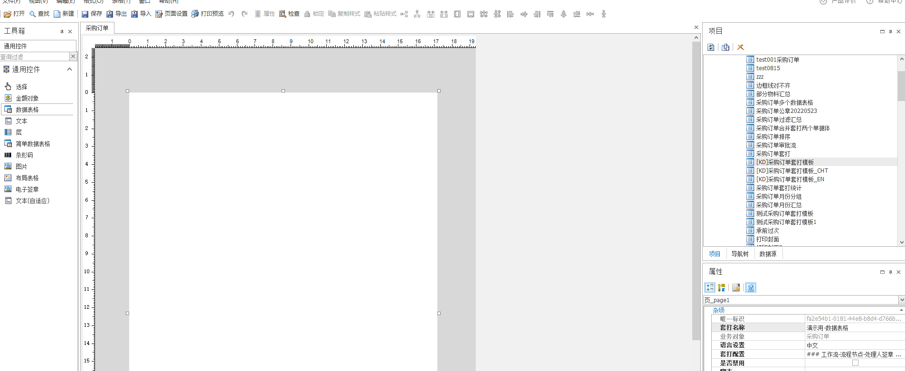
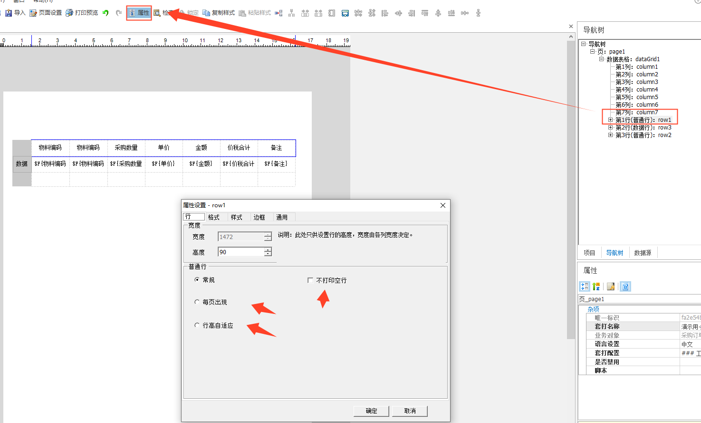
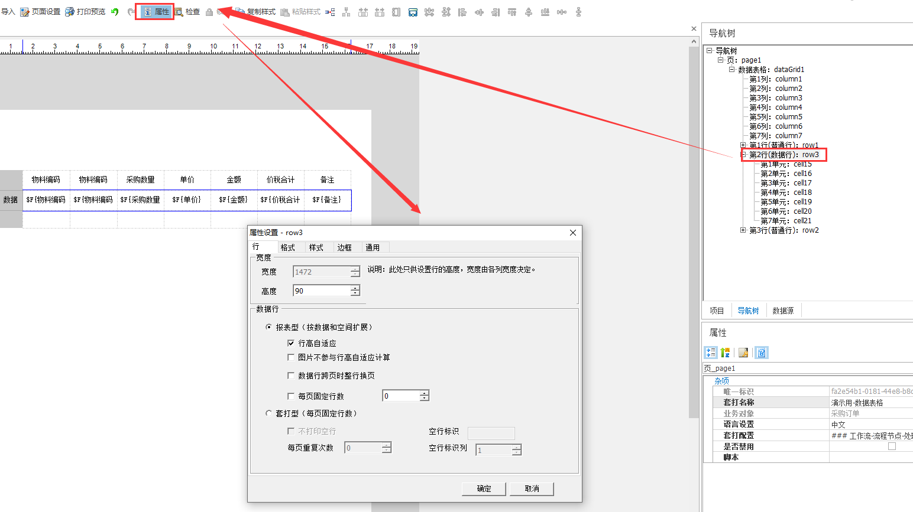
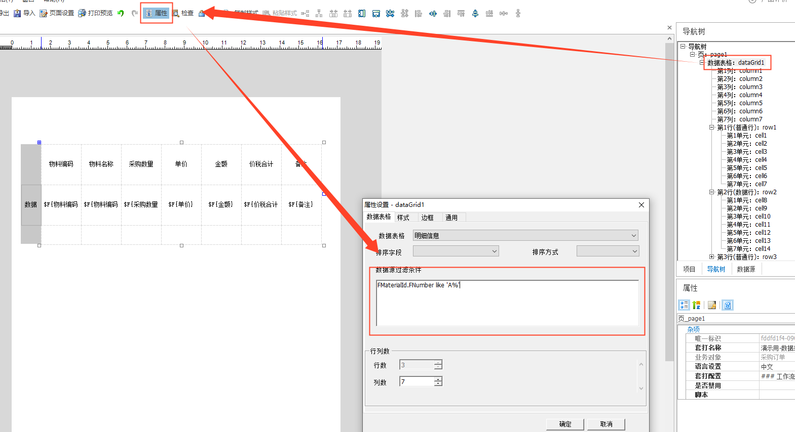

## 不同币别金额大写样式

【场景】在套打时，价税合计的金额大写样式想跟结算币别保持一致。当结算币别是人民币时，打印人民币金额大写；当结算币别是美元是，打印美元金额大写。【解决方案】通过动态字段取值，每个币别取一次。如 价税合计 if 结算币别.名称==&quot;人民币&quot; else &quot;&quot;在同一个单元格绑定多个文本字

## 页面设置

【简介】

打印的时候需要设计纸张尺寸、页边距、打印方向，根据实际内容去节纸打印。
【功能介绍】

支持设置纸张尺寸

支持设置页边距

支持设置打印方向

支持动态走纸（超市小票打印方式）

支持设置节纸打印

【使用说明】

纸张尺寸

允许选择常见的纸张尺寸，如A4、A5等。

允许自定义纸张尺寸，选择Custom，手动输入自定义纸张尺寸。

页边距，允许自定义设置上边距、下边距、左边距、右边距。

打印方向，支持横向打印、纵向打印。

动态走纸（动态走纸详细说明）

实现超市小票的模式打印，纸张长度无限，数据一直往下输出直到没有数据为止。

需要把纸张设置为Custom，打印方向设置为纵向才可以使用动态走纸的功能。

常用于套打导出excel连续无分页的场景。

节纸打印（节纸打印详细说明）

当输出内容太少，一张纸可以打出来多份的时候，可以通过节纸打印将多份数据打印到一页上。

支持横向节纸打印、纵向节纸打印，允许设置节纸间距（两份数据之间的间距）。

支持设置节纸打印按单计算页码。通常情况下按实际页数计算页码，如果想按照数据计算页码，可勾选参数“节纸打印按单计算页码”

注意，页面设置中的节纸打印需要和套打高级中的节纸打印共同使用。

**相关截图：**
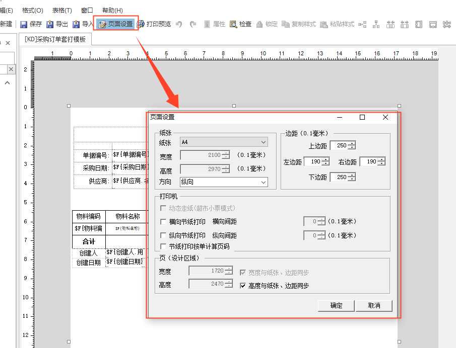
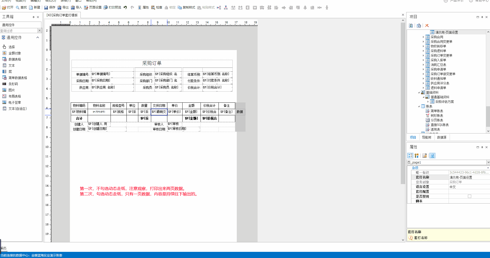
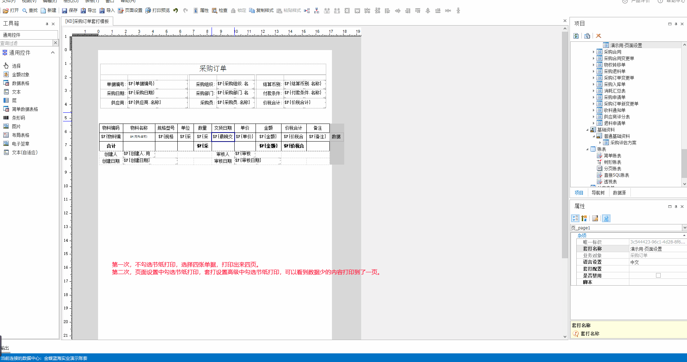

## 隔行不同颜色

【场景】套打数据行想实现隔行不同的颜色，便于观看。【案例】采购订单实现奇数行显示灰色，偶数行显示白色。创建动态字段，用于记录行号表单插件、列表插件计算行号属于奇数行、偶数行插件可在附件里复制。判断奇数行偶数行.rar套打在每行单元格内绑定动态字段，再利用脚本功能实现整行颜色显示，详细请参考链接，套打.脚本.满足条件整行

## 批次打印页数

批次打印页数，是设置套打时根据选择的单据数发送多个请求；若设置一个数值（如20）且选择100张单，则20张单为一个批次，一共发送5个请求，提高打印效率。适用于打印单数比较多的场景。 

有两个涉及到批次打印页数的参数。设置示例如下：

1、	在“套打设置-参数设置”中，“批次打印页数”参数，影响在单据或列表中的打印：

2、	在“参数设置-基础管理-BOS平台-套打参数中”，“后台打印批次打印页数”参数，影响“我的打印任务”： 

1）参数设置：

说明：a、默认值为空：空取100；

          b、设置为0，不分批；

          c、只影响后台打印；

2）“我的打印任务”设置：

**相关截图：**
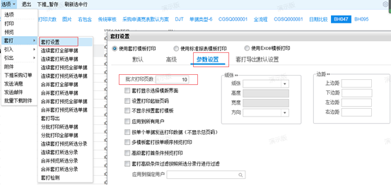
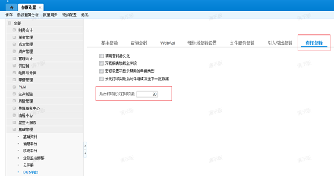
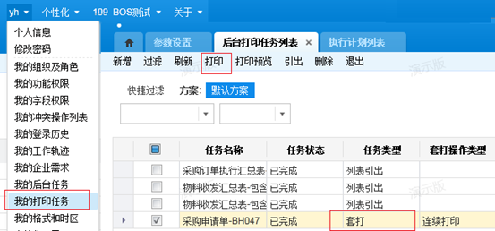

## 图片控件

“图片”控件作为打印图片的专属控件，在套打设计中经常使用。现在从以下几个方面介绍：

 1、	数据源 – 三种： 

      1）	动态图片：即绑定具体字段，打印业务对象中的具体的图片控件中的图片；

    

     2）	静态图片：自己上传图片，图片建议在50KB以内

     

    3）	生成图片：生成图片即用图片内容中输入框的内容生成图片，同时也可以字体、对齐方式、前景色（透明度目前不支持）

    

   套打模板示例：

    运行示例：单据有3条分录，前两条分录有图片字段

2、	“缩放”格式：

    设置图片的数据源后，可根据需求设置图片的缩放格式。有如下设置：

    

    效果如下图

  

    注意：如果图片较大，或者打印的图片较多，建议不用原图导出，可能会产生性能问题；

3、	图片最后导出： 

      背景：为了解决表格与图片内容有交叉重叠，套打时图片内容被遮挡的问题。 

      其效果如图：

**相关截图：**
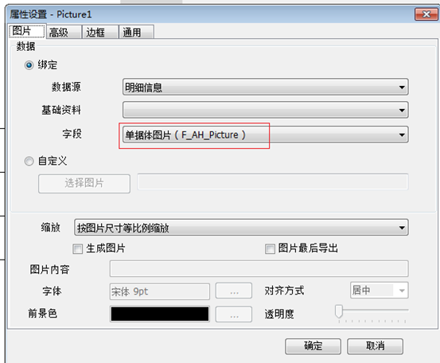
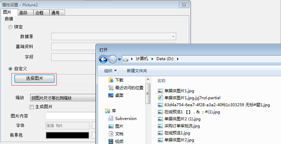
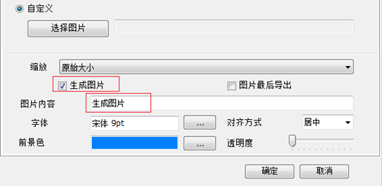
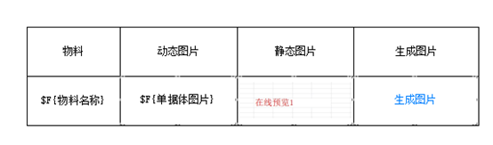
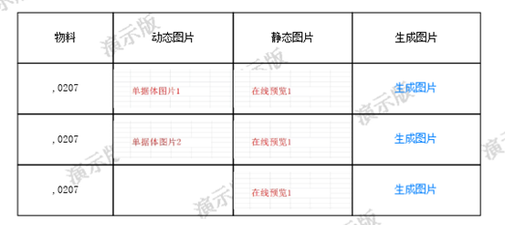

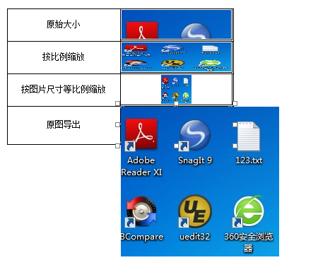
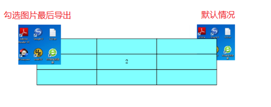

## 一个模板配置多个单据体

需求：在一个套打模板中打印多个单据体的数据。第一个数据表格打印完之后，紧接着输出第二个数据表格内容；分析：直接在套打模板中拖两个数据表格，第二个数据表格的输出位置会随着第一个数据表格的内容变化而变化。随着单据体数据的增多，第一个数据表格打印到第一页的尾部，第二个数据表格内容不够打或者只打印部分数据，在换页后，会出现第一

## 数据表格多个数据源

【问题描述】客户想在一个数据表格中，打印单据体和附件信息。以采购订单为例，先拖动[明细信息]的“物料”和“采购数量”到数据表格，再拖动[附件信息]的“文件名”，提示如下图：【解决方案】一、原因分析一个数据表格，不能同时绑定多个数据源二、解决方式先拖动[明细信息]的“物料”和“采购数量”到数据表格后，再拖动“文本”控件到

## 合并套打分组汇总

【业务场景】金税开票单希望将相同购货方合并套打在一页，（单据头字段）并且合计该页的价税合计金额字段。需求拆解：需要将多张单据合并打印，其中要按照单据头的字段分组换页。【解决方案】新建套打模板，设置数据表格，绑定单据头字段，发票号码、价税合计。设置分组，按照购货方名称、发票号码分组，设置购货方名称不同分组重启一页“不同分

## 汇总打印子单据体信息

【问题描述】组装拆卸单想要按照子件表的相同物料进行汇总需求拆解：按照子单据体汇总打印【解决方案】添加数据表格，绑定单据体和子单据体的数据。确保最后数据表格的数据源是单据体添加分组行，按照单据体的物料编码和单据体任意字段设置两个分组。保存后，将套打模板导出，打开文件搜索“g1”（g0是第一个分组，g1是第二个分组），将g

## 分组行一行不显示

【问题描述】想要实现设置了分组，想实现当分组内只有一行数据的时候，不显示分组行【解决方案】采用分组行的不打印空行功能+套打聚合动态字段实现，参考：https://vip.kingdee.com/knowledge/specialDetail/363025883948262656?category=36304803770

## 打印偏移跳页处理方案

【概述】套打打印出现上下偏移、左右偏移、跳页、部分内容打印被截断的问题【排查思路】以凭证打印为例，以下是排查思路，每一步排查完都可以尝试打印看效果，如果仍然有问题，再继续按照下面的步骤排查。1.确认各个地方的纸张规格是一致的。（1）套打模板的页面纸张（2）套打设置中的页面纸张（仅在套打高级勾选了“纸张设置”后才生效，如

## 科目余额表打印

【需求描述】科目余额表想要，科目和核算维度打在同一列，实现效果如图，科目名称和核算维度名称打印在同一列。【解决方案】前提条件，准备数据，设置过滤方案，必须勾选参数“显示核算维度明细”、“核算维度明细行显示科目信息”模板准备，准备数据表格，绑定单据体数据。设置分组管理，按照科目名称分组。设置动态字段，当核算维度为空时，显

## 单据打印

【问题描述】

付款单审核报错:error: expect token punctuation

【原因】

 该报错是银行账号信息保存到历史交易银行信息表时报错。

 检查付款单账号页签中对方银行账号“200772083110017”格式是否异常,比如有标点符号等,正常只需填写一串数据即可。

**相关截图：**
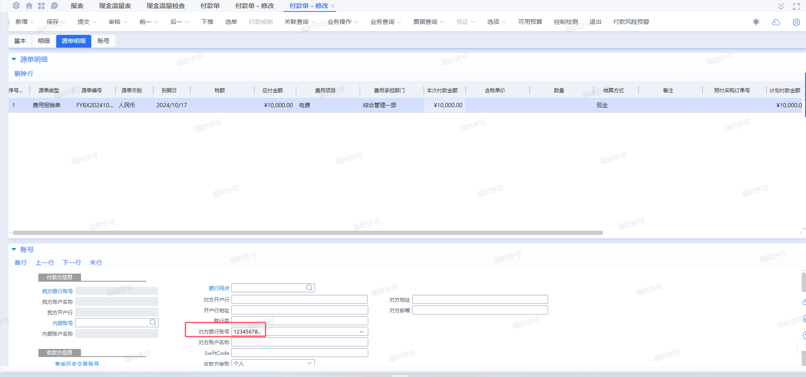

## 打印方向设置不生效

问题描述：打印方向设置不生效解决方案：打印方向控制三个地方：      1. 套打设计器页面设置              2. 运行时高级套打设置页签  &n

## 审批人签章图片打印

套打审批路线支持审批人签章图片打印。发布版本：7.5上线日期：2020-04-30补丁号：PT-146833

## 金额对象

知识详情，金蝶云社区,金蝶云,金蝶,财务,金融,会计,企业上云,企业信息化,财务信息化

## Python脚本合并打印

合并套打处理原则：打印时取第一张单据的单据头数据，将所有单据的分录数据进行合并打印。那么有小伙伴就问了，想合并套打时候单据编号取所有所选单据的编号合并打印该怎么做呢？答案是可以使用C#插件实现，也可以使用Python脚本实现，本示例介绍如何使用Pthon脚本实现，采购订单打印为例：BOS IDE里面扩展采购订单。单据列

## 打印右侧显示不全

问题描述：套打打印到纸上左右显示不全，如下图：解决方案：套打模板是打印的内容宽度已超出打印机最大可打印区域，超出部分打印机自动回截断。如爱普生LQ-590k打印机的可打印区域宽度度为20.3CM（可以查询打印机操作手册查看），那么如果套打模中设计的打印内容宽度超过20.3CM，就会出现打印到纸上显示不全的问题。这种情况

## 打印左右偏移

问题描述：套打打印到纸上右侧空白过多，如下图：解决方案：这种情况首先检查套打模板左右边距以及套打模板中控件布局是否左侧留白太多。如果检查套打模板左边距已经设置为0，模板中表格等控件也已经顶到最左侧，那么就需要调整打印机游标（链轮）了，如下图：

## 打印出现跳页空白页

问题描述：套打出现跳页，即打印时候中间有空白页出现。解决方案：1、   检查套打模板页面设置里面定义的纸张规格是否和实际纸张规格一致；2、   检查打印机驱动中默认纸张规格是否和实际纸张规格一致；3、   若1和2都没有问题，则可能是打印机驱动问题，可以从官网

## 父子单据体同表格打印

父子单据体打印，目前通常是使用数据表格嵌套简单数据表格来打印，也会有一些特殊场景，如需要按照子单据体数据分组汇总的情况，就无法通过数据表格嵌套简单数据表格来实现。

## 集成Codesoft条码打印

【应用场景】星空标准套打无法在小标签打印更多的内容时，可以选择与专业的条码软件集成，达到预期的打印效果。【注意事项】该实现方案非最佳实践，仅限于特殊场景下的特殊应用。【案例演示】参考下面实现步骤。【实现步骤】&lt;1&gt;客户端需要安装CodeSoft软件，并且确保CodeSoft软件能正常运行。编程实现调用Cod

## 工作流相关设置

本文介绍套打打印工作流相关的信息如何设置，星空针对工作流有四种常见的打印方式：审批路线、流程节点、多级审核信息、电子签章。

## 流程信息套打打印不出来

【问题描述】套打模板绑定了工作流打印，取不到流程信息，怎么办？【原因一及对应解决方案】原因一：单据里的状态字段没有审核中、已审核状态，或者对应状态字段的标识和标准单据的C、D不同。常见于PLM单据打印流程或者流程有发起人修改节点、单据为重新审核状态的情况。解决方案：套打模板套打配置中勾选参数“单据状态为重新审核且流程未

## 工作流签章打印不出来

【问题描述】套打打印不出来签章，怎么办？【前置知识】工作流节点有允许电子签章、移动端强制手签的参数。1、如果都勾选了，即勾选了移动端强制手签。电子签章控件、图片控件取处理人签章都能打印出来，取手签图片。2、如果只勾选了允许电子签章。电子签章控件、图片控件取处理人签章都能打印出来，取处理人个人信息中的图片。3、如果都没勾

## 父子单据体打印案例

【场景描述】单据中有父子单据体、打印的时候有特殊布局，如何设计？父子单据体打印常见于组装拆卸单 、工序计划、检验单等，本文以组装拆卸单为例，介绍父子单据体打印的四种方式。【数据准备】父单据体成品有两行，第一行对应四行子单据体子件数据，第二行对应三行子单据体子件数据。【方案一】最常规的方案，使用简单数据表格打印子单据体适

## 高级套打首条件预览打印

套打高级设置页签“高级套打首条件预览打印”勾选以后，如果“高级”里面配置了多个套打模板，则当匹配到第一个满足条件的套打模板后，就不再继续遍历后面的套打模板（无论后面的条件是否满足）。应用场景：客户套打销售出库单想设置条件，只要是有一行分录有折扣额的，就是要抵扣模板，否则就是有其他模板，则可使用套打设置里面高级条件设置里

## 费用报销影像条码显示

【问题描述】费用报销单使用套打导出没有影像条码，如下图所示：【原因分析】问题场景：出现在使用影像的单据，直接使用套打打印，而不是使用共享中心打印封面的操作。原因分析：共享中心的影像二维码不是简单的单据数据，需要二开插件获取，而标准预置的“共享中心打印封面”、“共享中心预览封面”等操作是通过共享中心动态字段二开干预的，但

## 根据指定行套打

【适用场景】1、在单据详情界面，打印指定行逻辑。2、模板设置不支持的换页逻辑，仅支持一个分录打印一次的场景（如检验单的检测项目、检测值打印）。【二开案例】案例：检验单，对指定行的分录明细进行套打；模拟列表的【连续套打预览所选分录】using Kingdee.BOS.Core.Bill.PlugIn;

## 行高自适应内容显示不全

&lt;0&gt;概述：行高自适应、自动换行下的内容被遮挡问题&lt;1&gt;原因：预览与打印在不同的端由于技术平台不同，会存在一定的差异，这个差异是由于微软操作系统，IE或Chrome或其他浏览器，DotNetFramwork技术平台和Silveright技术平台，HTML的JavsScript技术平台的等综合差异

## GetValue取数函数

套打GetValue取数函数允许传入格式化字符串。发布版本：V7.6版本上线日期：2020年10月

